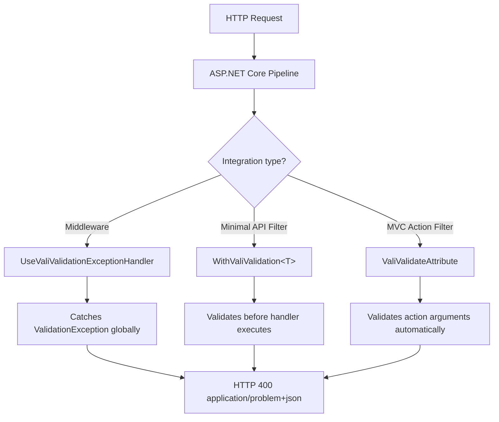

# ASP.NET Core Integration

The `Vali-Validation.AspNetCore` package provides three integration mechanisms with ASP.NET Core, each designed for a different use case.

## Install the Package

```bash
dotnet add package Vali-Validation.AspNetCore
```

---

## Integration Overview



---

## Middleware: UseValiValidationExceptionHandler

The middleware catches all `ValidationException` instances that propagate through the HTTP pipeline and converts them into an HTTP 400 response with `application/problem+json` format (RFC 7807).

### Register the Middleware

```csharp
// Program.cs
app.UseValiValidationExceptionHandler();
```

> **Order matters:** register the middleware **before** `UseRouting`, `UseAuthentication`, `UseAuthorization` and `MapControllers`/`MapEndpoints`. The middleware must be at the beginning of the pipeline to catch exceptions from the entire chain.

```csharp
var app = builder.Build();

app.UseSwagger();
app.UseSwaggerUI();

// Validation middleware first
app.UseValiValidationExceptionHandler();

// Then the rest of the pipeline
app.UseAuthentication();
app.UseAuthorization();
app.MapControllers();
app.MapGet("/health", () => Results.Ok());

app.Run();
```

### Response Format

When a `ValidationException` is caught, the response has this format:

```json
{
  "type": "https://tools.ietf.org/html/rfc7807",
  "title": "Validation Failed",
  "status": 400,
  "errors": {
    "Name": ["The name is required.", "The name must have at least 3 characters."],
    "Email": ["The email format is not valid."],
    "Price": ["The price must be greater than 0."]
  }
}
```

The response `Content-Type` is `application/problem+json`.

### When ValidationException Is Thrown

The middleware is useful when combined with `ValidateAndThrowAsync` in the service layer:

```csharp
// Service that throws
public class ProductService
{
    private readonly IValidator<CreateProductRequest> _validator;

    public ProductService(IValidator<CreateProductRequest> validator)
    {
        _validator = validator;
    }

    public async Task<Product> CreateAsync(CreateProductRequest request, CancellationToken ct)
    {
        await _validator.ValidateAndThrowAsync(request, ct);
        // If we get here, validation passed
        return await _repository.CreateAsync(request, ct);
    }
}

// Controller that needs no error handling
[ApiController]
[Route("api/[controller]")]
public class ProductsController : ControllerBase
{
    private readonly IProductService _service;

    public ProductsController(IProductService service)
    {
        _service = service;
    }

    [HttpPost]
    public async Task<IActionResult> Create(
        [FromBody] CreateProductRequest request,
        CancellationToken ct)
    {
        // ProductService.CreateAsync throws ValidationException if validation fails
        // The middleware catches it and returns 400 automatically
        var product = await _service.CreateAsync(request, ct);
        return CreatedAtAction(nameof(GetById), new { id = product.Id }, product);
    }
}
```

### With MediatR

The pattern is the same with MediatR — the behavior throws `ValidationException` and the middleware catches it:

```csharp
// Clean handler, no validation error handling
public class CreateProductHandler : IRequestHandler<CreateProductCommand, ProductDto>
{
    private readonly IProductRepository _repository;

    public CreateProductHandler(IProductRepository repository)
    {
        _repository = repository;
    }

    public async Task<ProductDto> Handle(
        CreateProductCommand command,
        CancellationToken ct)
    {
        // If we get here, the command's validation has already passed
        var product = await _repository.CreateAsync(command, ct);
        return new ProductDto(product);
    }
}
```

---

## AddValiValidationProblemDetails

`AddValiValidationProblemDetails` registers standard ASP.NET Core `ProblemDetails` support. It is required for `Results.ValidationProblem()` in Minimal APIs to use the RFC 7807 format correctly.

```csharp
builder.Services.AddValiValidationProblemDetails();
```

This call is especially useful if you also use `Results.ValidationProblem()` directly in your Minimal API endpoints.

---

## ValiValidationFilter\<T\>: Endpoint Filter for Minimal API

`ValiValidationFilter<T>` is an endpoint filter that automatically validates the argument of type `T` before executing the endpoint handler. If validation fails, it returns `Results.ValidationProblem(errors)` without executing the handler.

### Register with WithValiValidation\<T\>

```csharp
// Adds the filter to the endpoint — the handler does not execute if validation fails
app.MapPost("/products", async (
    [FromBody] CreateProductRequest request,
    [FromServices] IProductRepository repository,
    CancellationToken ct) =>
{
    // If we get here, CreateProductRequest has already been validated
    var product = await repository.CreateAsync(request, ct);
    return Results.Created($"/products/{product.Id}", product);
})
.WithValiValidation<CreateProductRequest>();
```

### Advantages Over Manual Validation

```csharp
// Without WithValiValidation: manual validation in each endpoint
app.MapPost("/products", async (request, validator, repository, ct) =>
{
    var result = await validator.ValidateAsync(request, ct);
    if (!result.IsValid)
        return Results.ValidationProblem(result.Errors.ToDictionary(
            k => k.Key, v => v.Value.ToArray()));

    var product = await repository.CreateAsync(request, ct);
    return Results.Created($"/products/{product.Id}", product);
});

// With WithValiValidation: the handler stays clean
app.MapPost("/products", async (request, repository, ct) =>
{
    var product = await repository.CreateAsync(request, ct);
    return Results.Created($"/products/{product.Id}", product);
})
.WithValiValidation<CreateProductRequest>();
```

### Example with Multiple Endpoints

```csharp
var productGroup = app.MapGroup("/products")
    .WithTags("Products");

productGroup.MapPost("/", async (
    [FromBody] CreateProductRequest request,
    [FromServices] IProductService service,
    CancellationToken ct) =>
{
    var product = await service.CreateAsync(request, ct);
    return Results.Created($"/products/{product.Id}", product);
})
.WithValiValidation<CreateProductRequest>();

productGroup.MapPut("/{id}", async (
    int id,
    [FromBody] UpdateProductRequest request,
    [FromServices] IProductService service,
    CancellationToken ct) =>
{
    var product = await service.UpdateAsync(id, request, ct);
    return Results.Ok(product);
})
.WithValiValidation<UpdateProductRequest>();

productGroup.MapDelete("/{id}", async (
    int id,
    [FromServices] IProductService service,
    CancellationToken ct) =>
{
    await service.DeleteAsync(id, ct);
    return Results.NoContent();
}); // No validation: no body to validate
```

### Error Response

When validation fails, the filter returns:

```http
HTTP/1.1 400 Bad Request
Content-Type: application/problem+json

{
  "type": "https://tools.ietf.org/html/rfc9110#section-15.5.1",
  "title": "One or more validation errors occurred.",
  "status": 400,
  "errors": {
    "Name": ["The name is required."],
    "Price": ["The price must be greater than 0."]
  }
}
```

---

## ValiValidateAttribute: Action Filter for MVC Controllers

`ValiValidateAttribute` is an action filter for MVC controllers. When applied to an action or a controller, it automatically validates all action arguments that have a registered `IValidator<T>` in DI. If any fail, it returns `BadRequestObjectResult` with `ValidationProblemDetails`.

### Apply to the Entire Controller

```csharp
[ApiController]
[Route("api/[controller]")]
[ValiValidate] // Applies to all controller actions
public class ProductsController : ControllerBase
{
    private readonly IProductService _service;

    public ProductsController(IProductService service)
    {
        _service = service;
    }

    [HttpPost]
    public async Task<IActionResult> Create(
        [FromBody] CreateProductRequest request, // Automatically validated
        CancellationToken ct)
    {
        // If we get here, request is valid
        var product = await _service.CreateAsync(request, ct);
        return CreatedAtAction(nameof(GetById), new { id = product.Id }, product);
    }

    [HttpPut("{id}")]
    public async Task<IActionResult> Update(
        int id,
        [FromBody] UpdateProductRequest request, // Automatically validated
        CancellationToken ct)
    {
        var product = await _service.UpdateAsync(id, request, ct);
        return Ok(product);
    }

    [HttpGet("{id}")]
    public async Task<IActionResult> GetById(int id) // No body, nothing to validate
    {
        var product = await _service.GetByIdAsync(id);
        return product is null ? NotFound() : Ok(product);
    }
}
```

### Apply to a Specific Action

```csharp
[ApiController]
[Route("api/[controller]")]
public class OrdersController : ControllerBase
{
    private readonly IOrderService _service;

    public OrdersController(IOrderService service)
    {
        _service = service;
    }

    [HttpPost]
    [ValiValidate] // Only this action uses the filter
    public async Task<IActionResult> Create(
        [FromBody] CreateOrderRequest request,
        CancellationToken ct)
    {
        var order = await _service.CreateAsync(request, ct);
        return CreatedAtAction(nameof(GetById), new { id = order.Id }, order);
    }

    [HttpPost("{id}/cancel")]
    public async Task<IActionResult> Cancel(int id, CancellationToken ct)
    {
        // Without [ValiValidate]: no body to validate
        await _service.CancelAsync(id, ct);
        return NoContent();
    }
}
```

### Error Response from ValiValidateAttribute

```json
{
  "type": "https://tools.ietf.org/html/rfc7807",
  "title": "One or more validation errors occurred.",
  "status": 400,
  "errors": {
    "CustomerId": ["The customer does not exist."],
    "Items": ["The order must have at least one item."]
  }
}
```

---

## When to Use Each Mechanism

| Mechanism | When to use |
|---|---|
| `UseValiValidationExceptionHandler` | When validation occurs in the service layer (with `ValidateAndThrowAsync`) or when using the MediatR behavior |
| `WithValiValidation<T>` | Minimal API endpoints where the handler receives the body directly |
| `[ValiValidate]` | MVC controllers where the action receives the body as an argument |

### Combined Mechanisms

You can use all of them at the same time without conflicts:

```csharp
var builder = WebApplication.CreateBuilder(args);

builder.Services.AddControllers();
builder.Services.AddValidationsFromAssembly(typeof(Program).Assembly);
builder.Services.AddValiValidationProblemDetails(); // For Minimal API

var app = builder.Build();

// Middleware: catches ValidationException from the service layer
app.UseValiValidationExceptionHandler();

// MVC with [ValiValidate] on controllers
app.MapControllers();

// Minimal API with WithValiValidation
app.MapPost("/api/quick-order", async (QuickOrderRequest request, IOrderService service) =>
{
    var order = await service.CreateAsync(request);
    return Results.Ok(order);
})
.WithValiValidation<QuickOrderRequest>();
```

---

## Complete Program.cs Registration with ASP.NET Core

```csharp
using Vali_Validation.Core.Extensions;

var builder = WebApplication.CreateBuilder(args);

// Infrastructure
builder.Services.AddDbContext<AppDbContext>(opt =>
    opt.UseSqlServer(builder.Configuration.GetConnectionString("Default")));

// Authentication and authorization
builder.Services
    .AddAuthentication(JwtBearerDefaults.AuthenticationScheme)
    .AddJwtBearer(opt => builder.Configuration.Bind("Jwt", opt));
builder.Services.AddAuthorization();

// Validation
builder.Services.AddValidationsFromAssembly(
    typeof(Program).Assembly,
    ServiceLifetime.Scoped);
builder.Services.AddValiValidationProblemDetails();

// ASP.NET Core
builder.Services.AddControllers();
builder.Services.AddEndpointsApiExplorer();
builder.Services.AddSwaggerGen();

// Application services
builder.Services.AddScoped<IProductService, ProductService>();
builder.Services.AddScoped<IOrderService, OrderService>();

var app = builder.Build();

// Pipeline
if (app.Environment.IsDevelopment())
{
    app.UseSwagger();
    app.UseSwaggerUI();
}

app.UseValiValidationExceptionHandler(); // Before authentication/authorization
app.UseAuthentication();
app.UseAuthorization();
app.MapControllers();

// Additional endpoints
app.MapGet("/health", () => Results.Ok(new { status = "healthy" }))
   .AllowAnonymous();

app.Run();
```

---

## Next Steps

- **[MediatR](mediatr-integration)** — Pipeline behavior for MediatR
- **[Vali-Mediator](valimediator-integration)** — Pipeline behavior with Result\<T\>
- **[Dependency Injection](dependency-injection)** — Validator registration and resolution
