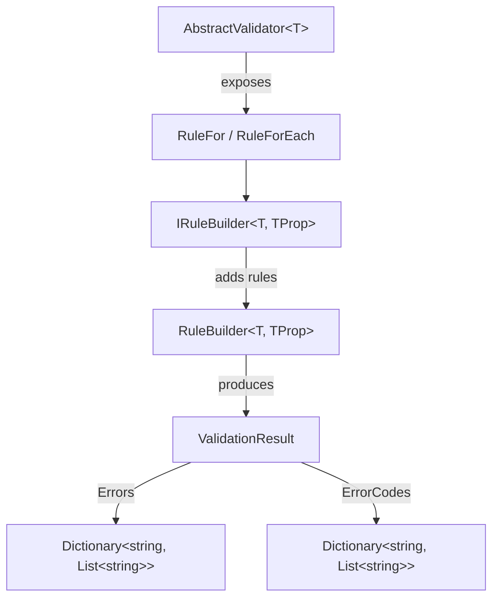
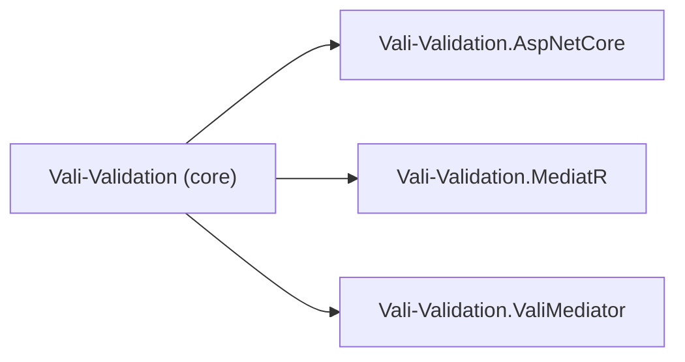
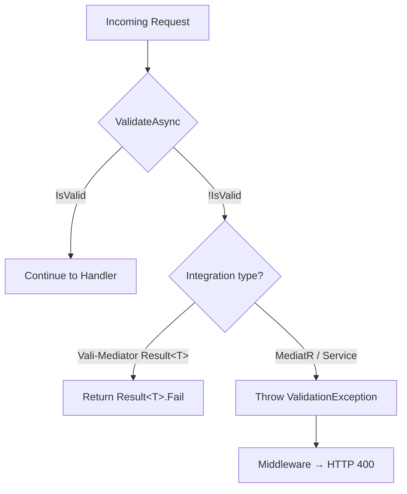

# Vali-Validation

Lightweight fluent validation library for **.NET 7, 8, and 9** — zero external dependencies.

## Architecture Overview



## Package Ecosystem



| Package | Purpose |
|---|---|
| `Vali-Validation` | Core library: validators, rules, ValidationResult, ValidationException |
| `Vali-Validation.AspNetCore` | Middleware, endpoint filters, action filters |
| `Vali-Validation.MediatR` | IPipelineBehavior for MediatR (throws ValidationException) |
| `Vali-Validation.ValiMediator` | IPipelineBehavior for Vali-Mediator (returns Result&lt;T&gt;.Fail) |

## Validation Flow



## Quick Example

```csharp
public class CreateProductValidator : AbstractValidator<CreateProductRequest>
{
    public CreateProductValidator()
    {
        RuleFor(x => x.Name)
            .NotEmpty().WithMessage("Name is required.")
            .MinimumLength(3);

        RuleFor(x => x.Price)
            .GreaterThan(0m).WithMessage("Price must be positive.");
    }
}

// DI registration
builder.Services.AddValidationsFromAssembly(typeof(Program).Assembly);

// Usage
var result = await validator.ValidateAsync(request);
if (!result.IsValid)
    return Results.ValidationProblem(result.Errors.ToDictionary(k => k.Key, v => v.Value.ToArray()));
```

## Get Started

- [Introduction](introduction) — What is Vali-Validation and how it compares
- [Installation](installation) — NuGet packages and project setup
- [Quick Start](quick-start) — A complete working example in minutes
