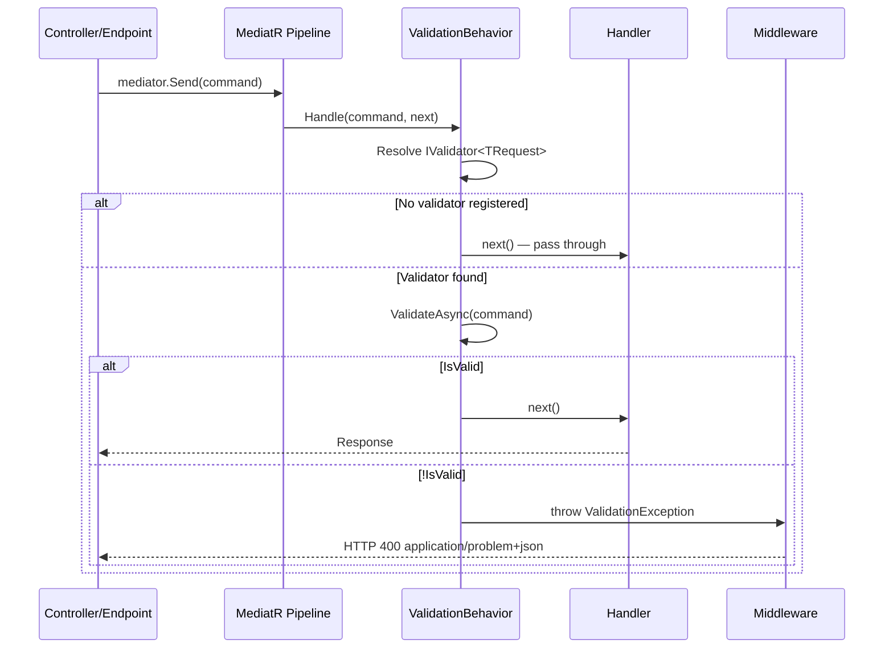

# MediatR Integration

The `Vali-Validation.MediatR` package registers an `IPipelineBehavior<TRequest, TResponse>` that automatically validates the request before it reaches the handler. If validation fails, it throws `ValidationException`.

## Install

```bash
dotnet add package Vali-Validation.MediatR
dotnet add package MediatR
```

The `Vali-Validation.MediatR` package already depends on `Vali-Validation` (core), so you do not need to install it separately in the API project.

---

## Pipeline Flow



---

## How the Pipeline Works

The behavior does the following:

1. Attempts to resolve `IValidator<TRequest>` from the DI container.
2. If no validator is registered, the request passes directly to the handler (no-op).
3. If there is a validator, executes `ValidateAsync(request)`.
4. If `!result.IsValid`, throws `ValidationException` with all errors.
5. If valid, calls `next()` and the handler executes.

---

## Registration Methods

### Option 1: AddValiValidationBehavior (behavior only)

```csharp
// Only registers the behavior — you register MediatR and validators separately
builder.Services.AddMediatR(cfg => cfg.RegisterServicesFromAssembly(assembly));
builder.Services.AddValidationsFromAssembly(assembly);
builder.Services.AddValiValidationBehavior(); // Adds the behavior to the pipeline
```

### Option 2: AddMediatRWithValidation (all-in-one)

```csharp
// Registers MediatR, the behavior and validators from the assembly in a single call
builder.Services.AddMediatRWithValidation(
    cfg => cfg.RegisterServicesFromAssembly(typeof(Program).Assembly),
    validatorsAssembly: typeof(Program).Assembly,
    lifetime: ServiceLifetime.Transient);
```

If validators are in a different assembly from the handlers:

```csharp
builder.Services.AddMediatRWithValidation(
    cfg => cfg.RegisterServicesFromAssembly(typeof(ApplicationAssembly).Assembly),
    validatorsAssembly: typeof(ApplicationAssembly).Assembly,
    lifetime: ServiceLifetime.Scoped); // Scoped if validators use DbContext
```

---

## Complete Example

### Model and Command

```csharp
// Application/Commands/CreateProduct/CreateProductCommand.cs
public record CreateProductCommand : IRequest<ProductDto>
{
    public string Name { get; init; } = string.Empty;
    public string Description { get; init; } = string.Empty;
    public decimal Price { get; init; }
    public int Stock { get; init; }
    public string Category { get; init; } = string.Empty;
}

public record ProductDto(int Id, string Name, decimal Price, string Category);
```

### Validator

```csharp
// Application/Commands/CreateProduct/CreateProductCommandValidator.cs
using Vali_Validation.Core.Validators;

public class CreateProductCommandValidator : AbstractValidator<CreateProductCommand>
{
    private static readonly string[] ValidCategories =
        new[] { "Electronics", "Clothing", "Books", "Food", "Other" };

    public CreateProductCommandValidator()
    {
        RuleFor(x => x.Name)
            .NotEmpty()
                .WithMessage("The product name is required.")
                .WithErrorCode("NAME_REQUIRED")
            .MinimumLength(3)
                .WithMessage("The name must have at least 3 characters.")
            .MaximumLength(200)
                .WithMessage("The name cannot exceed 200 characters.");

        RuleFor(x => x.Description)
            .MaximumLength(1000)
                .WithMessage("The description cannot exceed 1000 characters.");

        RuleFor(x => x.Price)
            .GreaterThan(0m)
                .WithMessage("The price must be greater than 0.")
                .WithErrorCode("PRICE_INVALID")
            .MaxDecimalPlaces(2)
                .WithMessage("The price cannot have more than 2 decimal places.");

        RuleFor(x => x.Stock)
            .GreaterThanOrEqualTo(0)
                .WithMessage("The stock cannot be negative.");

        RuleFor(x => x.Category)
            .NotEmpty()
                .WithMessage("The category is required.")
            .In(ValidCategories)
                .WithMessage($"The category must be one of: {string.Join(", ", ValidCategories)}.");
    }
}
```

### Handler

```csharp
// Application/Commands/CreateProduct/CreateProductHandler.cs
public class CreateProductHandler : IRequestHandler<CreateProductCommand, ProductDto>
{
    private readonly IProductRepository _repository;
    private readonly ILogger<CreateProductHandler> _logger;

    public CreateProductHandler(IProductRepository repository, ILogger<CreateProductHandler> logger)
    {
        _repository = repository;
        _logger = logger;
    }

    public async Task<ProductDto> Handle(
        CreateProductCommand command,
        CancellationToken cancellationToken)
    {
        // If we get here, validation has already passed in the behavior
        // No need to validate manually
        _logger.LogInformation("Creating product: {Name}", command.Name);

        var product = new Product
        {
            Name = command.Name,
            Description = command.Description,
            Price = command.Price,
            Stock = command.Stock,
            Category = command.Category
        };

        var created = await _repository.CreateAsync(product, cancellationToken);

        return new ProductDto(created.Id, created.Name, created.Price, created.Category);
    }
}
```

### Controller

```csharp
// Api/Controllers/ProductsController.cs
[ApiController]
[Route("api/[controller]")]
public class ProductsController : ControllerBase
{
    private readonly IMediator _mediator;

    public ProductsController(IMediator mediator)
    {
        _mediator = mediator;
    }

    [HttpPost]
    [ProducesResponseType(typeof(ProductDto), StatusCodes.Status201Created)]
    [ProducesResponseType(typeof(ProblemDetails), StatusCodes.Status400BadRequest)]
    public async Task<IActionResult> Create(
        [FromBody] CreateProductCommand command,
        CancellationToken ct)
    {
        // The behavior validates before reaching the handler.
        // If validation fails → ValidationException → middleware returns 400.
        // If validation passes → handler returns ProductDto.
        var product = await _mediator.Send(command, ct);
        return CreatedAtAction(nameof(GetById), new { id = product.Id }, product);
    }

    [HttpGet("{id}")]
    public async Task<IActionResult> GetById(int id, CancellationToken ct)
    {
        var product = await _mediator.Send(new GetProductByIdQuery(id), ct);
        return product is null ? NotFound() : Ok(product);
    }
}
```

### Program.cs

```csharp
using Vali_Validation.Core.Extensions;

var builder = WebApplication.CreateBuilder(args);

// Infrastructure
builder.Services.AddDbContext<AppDbContext>(opt =>
    opt.UseSqlServer(builder.Configuration.GetConnectionString("Default")));

// MediatR + Validation (all-in-one)
builder.Services.AddMediatRWithValidation(
    cfg => cfg.RegisterServicesFromAssembly(typeof(Program).Assembly),
    validatorsAssembly: typeof(Program).Assembly,
    lifetime: ServiceLifetime.Transient);

// ASP.NET Core
builder.Services.AddControllers();
builder.Services.AddEndpointsApiExplorer();
builder.Services.AddSwaggerGen();

var app = builder.Build();

app.UseSwagger();
app.UseSwaggerUI();
app.UseValiValidationExceptionHandler(); // Catches ValidationException from the behavior
app.MapControllers();

app.Run();
```

---

## Behavior When There Is No Validator

If you send a command or query with no registered validator, the behavior lets it pass without error:

```csharp
// This query has no validator
public record GetAllProductsQuery : IRequest<List<ProductDto>>;

// The behavior does nothing, the handler executes directly
var products = await _mediator.Send(new GetAllProductsQuery());
```

This is intentional: it is not required to have a validator for every request. Only requests that need one.

---

## CancellationToken in the Behavior

The behavior passes the pipeline's `CancellationToken` to `ValidateAsync`, so if the client cancels the request, the async validation is also cancelled:

```csharp
// In the validator, the behavior's CT arrives here:
RuleFor(x => x.Email)
    .MustAsync(async (email, ct) =>
    {
        // If the client cancels, ct is cancelled and the query throws OperationCanceledException
        return !await _users.EmailExistsAsync(email, ct);
    });
```

---

## Complete Error Flow

```
POST /api/products
Body: { "name": "", "price": -5, "category": "Unknown" }

→ MediatR pipeline
→ ValidationBehavior<CreateProductCommand, ProductDto>
    → ValidateAsync(command)
    → result.IsValid = false
    → throw new ValidationException(result)
→ UseValiValidationExceptionHandler middleware
    → Response 400:
       {
         "type": "https://tools.ietf.org/html/rfc7807",
         "title": "Validation Failed",
         "status": 400,
         "errors": {
           "Name": ["The product name is required."],
           "Price": ["The price must be greater than 0."],
           "Category": ["The category must be one of: Electronics, Clothing, Books, Food, Other."]
         }
       }
```

---

## Testing the Validator with MediatR

```csharp
public class CreateProductCommandValidatorTests
{
    private readonly CreateProductCommandValidator _validator = new();

    [Fact]
    public async Task EmptyName_ShouldFail()
    {
        var command = new CreateProductCommand { Name = "", Price = 10, Category = "Books" };
        var result = await _validator.ValidateAsync(command);

        Assert.False(result.IsValid);
        Assert.True(result.HasErrorFor("Name"));
    }

    [Fact]
    public async Task ValidCommand_ShouldPass()
    {
        var command = new CreateProductCommand
        {
            Name = "Clean Code",
            Price = 29.99m,
            Stock = 100,
            Category = "Books"
        };

        var result = await _validator.ValidateAsync(command);
        Assert.True(result.IsValid);
    }
}
```

---

## Next Steps

- **[Vali-Mediator](valimediator-integration)** — Alternative with Result\<T\> instead of exceptions
- **[ASP.NET Core](aspnetcore-integration)** — Middleware that catches the behavior's exception
