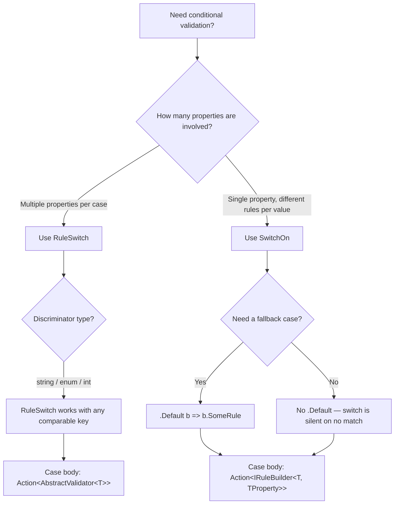

# Switch / Case — Advanced Conditional Validation

This document describes two complementary features for conditional validation in Vali-Validation: **`RuleSwitch`** and **`SwitchOn`**. Both allow applying different sets of rules depending on a runtime value, but they operate at different levels of granularity and serve distinct purposes.

---

## Overview

| Feature | Level | Key question |
|---|---|---|
| `RuleSwitch` | Validator (multiple properties) | "Which group of rules should I run for the whole object?" |
| `SwitchOn` | Property (single property) | "Which rules apply to *this specific field* depending on another field?" |

Both features share the same core semantics:

- **Exclusivity**: only one case executes per validation run. As soon as a matching key is found, the remaining cases are skipped.
- **Default fallback**: an optional `.Default(...)` branch runs when no case matches.
- **No match, no Default**: if no case matches and no Default is defined, the switch block produces no errors (it is silent, not an error in itself).
- **Global rules are unaffected**: rules defined outside the switch always execute.

---

## RuleSwitch vs SwitchOn Decision Tree



---

## Comparison at a Glance

| | `RuleSwitch` | `SwitchOn` |
|---|---|---|
| Where it is called | Inside `AbstractValidator<T>` constructor | Chained on a `RuleFor(...)` call |
| Discriminator | Any property of the root object | Any property of the root object |
| Scope of each case | Multiple properties, full rule sets | A single property |
| Case body type | `Action<AbstractValidator<T>>` | `Action<IRuleBuilder<T, TProperty>>` |
| Global rules mixed in | Yes (defined outside the switch) | Yes (defined before `.SwitchOn(...)`) |
| Async rule support | Yes (`MustAsync`, `DependentRuleAsync`) | Yes (`MustAsync`, `WhenAsync`) |

---

## Part 1: RuleSwitch

### What Is RuleSwitch

`RuleSwitch` is a validator-level switch/case block. It is defined inside the constructor of a class that inherits `AbstractValidator<T>`. It reads a discriminator value from the object being validated and applies the matching case's rules — rules that can span multiple properties.

The method signature is:

```csharp
protected ICaseBuilder<T, TKey> RuleSwitch<TKey>(Expression<Func<T, TKey>> keyExpression)
```

### ICaseBuilder Interface

```csharp
public interface ICaseBuilder<T, TKey> where T : class
{
    // Applies rules when the discriminator equals value
    ICaseBuilder<T, TKey> Case(TKey value, Action<AbstractValidator<T>> configure);

    // Applies rules when no case matches
    ICaseBuilder<T, TKey> Default(Action<AbstractValidator<T>> configure);
}
```

### Example 1 — Payment Method (String Discriminator)

```csharp
public class PaymentValidator : AbstractValidator<PaymentDto>
{
    public PaymentValidator()
    {
        // Global rules — always execute regardless of Method
        RuleFor(x => x.Amount)
            .GreaterThan(0)
            .WithMessage("The Amount field must be greater than zero.");

        RuleFor(x => x.Method)
            .NotEmpty()
            .WithMessage("The Method field is required.");

        // Switch: exactly one case executes based on x.Method
        RuleSwitch(x => x.Method)
            .Case("credit_card", rules =>
            {
                rules.RuleFor(x => x.CardNumber)
                    .NotEmpty()
                        .WithMessage("The CardNumber field is required for credit card payments.")
                    .CreditCard()
                        .WithMessage("The CardNumber field must be a valid credit card number.");

                rules.RuleFor(x => x.Cvv)
                    .NotEmpty()
                        .WithMessage("The Cvv field is required.")
                    .MinimumLength(3)
                    .MaximumLength(4)
                        .WithMessage("The Cvv field must be between 3 and 4 characters.");

                rules.RuleFor(x => x.ExpirationDate)
                    .NotNull()
                        .WithMessage("The ExpirationDate field is required.")
                    .FutureDate()
                        .WithMessage("The ExpirationDate must be in the future.");
            })
            .Case("bank_transfer", rules =>
            {
                rules.RuleFor(x => x.Iban)
                    .NotEmpty()
                        .WithMessage("The Iban field is required for bank transfer payments.")
                    .Iban()
                        .WithMessage("The Iban field must be a valid IBAN.");

                rules.RuleFor(x => x.BankCode)
                    .NotEmpty()
                        .WithMessage("The BankCode field is required.");
            })
            .Case("paypal", rules =>
            {
                rules.RuleFor(x => x.PaypalEmail)
                    .NotEmpty()
                        .WithMessage("The PaypalEmail field is required for PayPal payments.")
                    .Email()
                        .WithMessage("The PaypalEmail field must be a valid email address.");
            })
            .Default(rules =>
            {
                // Executed when Method is anything other than the three cases above
                rules.RuleFor(x => x.Reference)
                    .NotEmpty()
                        .WithMessage("The Reference field is required for this payment method.");
            });
    }
}
```

### Usage

```csharp
var validator = new PaymentValidator();

// Scenario: credit card with missing CVV
var payment = new PaymentDto
{
    Amount = 150.00m,
    Method = "credit_card",
    CardNumber = "4111111111111111",
    Cvv = null,                        // missing
    ExpirationDate = DateTime.Now.AddYears(2)
};

var result = await validator.ValidateAsync(payment);
// result.IsValid == false
// result.Errors["Cvv"] == ["The Cvv field is required."]
// "Iban", "BankCode", "PaypalEmail" are NOT reported — those cases were skipped
```

### Example 2 — User Type (Enum Discriminator)

```csharp
public enum UserType { Admin, Client, Guest }

public class CreateUserValidator : AbstractValidator<CreateUserDto>
{
    public CreateUserValidator()
    {
        // Global — applies to every user type
        RuleFor(x => x.Username)
            .NotEmpty()
            .MinimumLength(3)
            .MaximumLength(50)
            .IsAlphanumeric();

        RuleFor(x => x.Email)
            .NotEmpty()
            .Email();

        RuleSwitch(x => x.Type)
            .Case(UserType.Admin, rules =>
            {
                rules.RuleFor(x => x.AdminAccessCode)
                    .NotEmpty()
                        .WithMessage("Admins must provide an access code.")
                    .MinimumLength(16)
                        .WithMessage("The admin access code must be at least 16 characters.");

                rules.RuleFor(x => x.Permissions)
                    .NotEmptyCollection()
                        .WithMessage("Admins must have at least one permission assigned.");
            })
            .Case(UserType.Client, rules =>
            {
                rules.RuleFor(x => x.CompanyName)
                    .NotEmpty()
                        .WithMessage("Company name is required for client accounts.");

                rules.RuleFor(x => x.TaxId)
                    .NotEmpty()
                        .WithMessage("Tax ID is required for client accounts.")
                    .Matches(@"^[A-Z0-9]{9,13}$")
                        .WithMessage("Tax ID must be between 9 and 13 uppercase alphanumeric characters.");
            })
            .Case(UserType.Guest, rules =>
            {
                rules.RuleFor(x => x.SessionToken)
                    .NotEmpty()
                        .WithMessage("A session token is required for guest access.")
                    .Guid()
                        .WithMessage("The session token must be a valid GUID.");
            });
        // No .Default() — if Type is an unknown enum value, only global rules run
    }
}
```

---

## Part 2: SwitchOn

### What Is SwitchOn

`SwitchOn` is a **property-level** switch. It is chained directly on a `RuleFor(...)` call and determines which rules to apply to that single property based on the value of another property.

The method signature is:

```csharp
public ISwitchOnBuilder<T, TProperty, TKey> SwitchOn<TKey>(
    Expression<Func<T, TKey>> keyExpression)
```

### ISwitchOnBuilder Interface

```csharp
public interface ISwitchOnBuilder<T, TProperty, TKey> where T : class
{
    ISwitchOnBuilder<T, TProperty, TKey> Case(
        TKey value,
        Action<IRuleBuilder<T, TProperty>> configure);

    ISwitchOnBuilder<T, TProperty, TKey> Default(
        Action<IRuleBuilder<T, TProperty>> configure);
}
```

### Example: Document Number Validation

```csharp
public class DocumentValidator : AbstractValidator<DocumentDto>
{
    public DocumentValidator()
    {
        RuleFor(x => x.DocumentNumber)
            .SwitchOn(x => x.DocumentType)
            .Case("passport", b => b
                .NotEmpty()
                .Matches(@"^[A-Z]{2}\d{6}$")
                    .WithMessage("The passport number must have the format AA999999."))
            .Case("dni", b => b
                .NotEmpty()
                .IsNumeric()
                .MinimumLength(8)
                .MaximumLength(8)
                    .WithMessage("The DNI must be exactly 8 digits."))
            .Case("ruc", b => b
                .NotEmpty()
                .IsNumeric()
                .MinimumLength(11)
                .MaximumLength(11)
                    .WithMessage("The RUC must be exactly 11 digits."))
            .Default(b => b.NotEmpty());
    }
}
```

### SwitchOn vs When/Unless

| | `SwitchOn` | `When` / `Unless` |
|---|---|---|
| Exclusivity | Only **one** case runs | Each `When` block is evaluated **independently** |
| Multiple variants | One construct covers all variants | Requires one `RuleFor(...).When(...)` per variant |
| Overlap | Impossible by design | Possible if conditions are not mutually exclusive |

---

## Combining RuleSwitch and Global Rules

Rules declared before `RuleSwitch` always execute regardless of which case matches. This lets you express a clean separation: global invariants at the top, variant-specific invariants inside the switch.

```csharp
public class PaymentValidator : AbstractValidator<PaymentDto>
{
    public PaymentValidator()
    {
        // Global rules: always evaluated
        RuleFor(x => x.Amount).Positive();
        RuleFor(x => x.Currency).NotEmpty().CurrencyCode();

        // Variant rules: only the matching case is evaluated
        RuleSwitch(x => x.Method)
            .Case("credit_card", rules =>
            {
                rules.RuleFor(x => x.CardNumber).NotEmpty().CreditCard();
                rules.RuleFor(x => x.Cvv).NotEmpty().MinimumLength(3).MaximumLength(4);
                rules.RuleFor(x => x.CardHolder).NotEmpty();
            })
            .Case("bank_transfer", rules =>
            {
                rules.RuleFor(x => x.Iban).NotEmpty().Iban();
                rules.RuleFor(x => x.BankName).NotEmpty();
            })
            .Case("paypal", rules =>
            {
                rules.RuleFor(x => x.PaypalEmail).NotEmpty().Email();
            });
    }
}
```

The `Amount` and `Currency` rules run first for every payment, then exactly one case from the switch runs based on `Method`. If `Method` does not match any case and no `.Default(...)` is provided, the switch contributes no additional errors.

---

## Notification Entity with Channel-Dependent Fields

```csharp
public class NotificationValidator : AbstractValidator<NotificationRequest>
{
    public NotificationValidator()
    {
        // Common rules — always validated
        RuleFor(x => x.Title).NotEmpty().MaximumLength(100);
        RuleFor(x => x.Body).NotEmpty().MaximumLength(500);

        RuleFor(x => x.Channel)
            .NotEmpty()
            .In(new[] { "email", "sms", "push" })
                .WithMessage("The notification channel must be email, sms or push.")
            .StopOnFirstFailure();

        // Channel-specific rules
        RuleSwitch(x => x.Channel)
            .Case("email", rules =>
            {
                rules.RuleFor(x => x.RecipientEmail)
                    .NotEmpty()
                        .WithMessage("An email address is required for email notifications.")
                    .Email()
                        .WithMessage("The recipient email address is not valid.");
            })
            .Case("sms", rules =>
            {
                rules.RuleFor(x => x.RecipientPhone)
                    .NotEmpty()
                        .WithMessage("A phone number is required for SMS notifications.")
                    .PhoneNumber()
                        .WithMessage("The recipient phone number is not valid.");

                // SMS bodies are limited by character count
                rules.RuleFor(x => x.Body)
                    .MaximumLength(160)
                        .WithMessage("SMS messages cannot exceed 160 characters.");
            })
            .Case("push", rules =>
            {
                rules.RuleFor(x => x.DeviceToken)
                    .NotEmpty()
                        .WithMessage("A device token is required for push notifications.");

                rules.RuleFor(x => x.PushPlatform)
                    .NotEmpty()
                        .WithMessage("The push platform must be specified.")
                    .In(new[] { "ios", "android" })
                        .WithMessage("The push platform must be ios or android.");
            });
    }
}
```

---

## Next Steps

- **[Advanced Patterns](advanced-patterns)** — Composition and inheritance
- **[Modifiers](modifiers)** — When/Unless and other per-rule modifiers
- **[Advanced Rules](advanced-rules)** — Must, MustAsync, Custom, Transform
