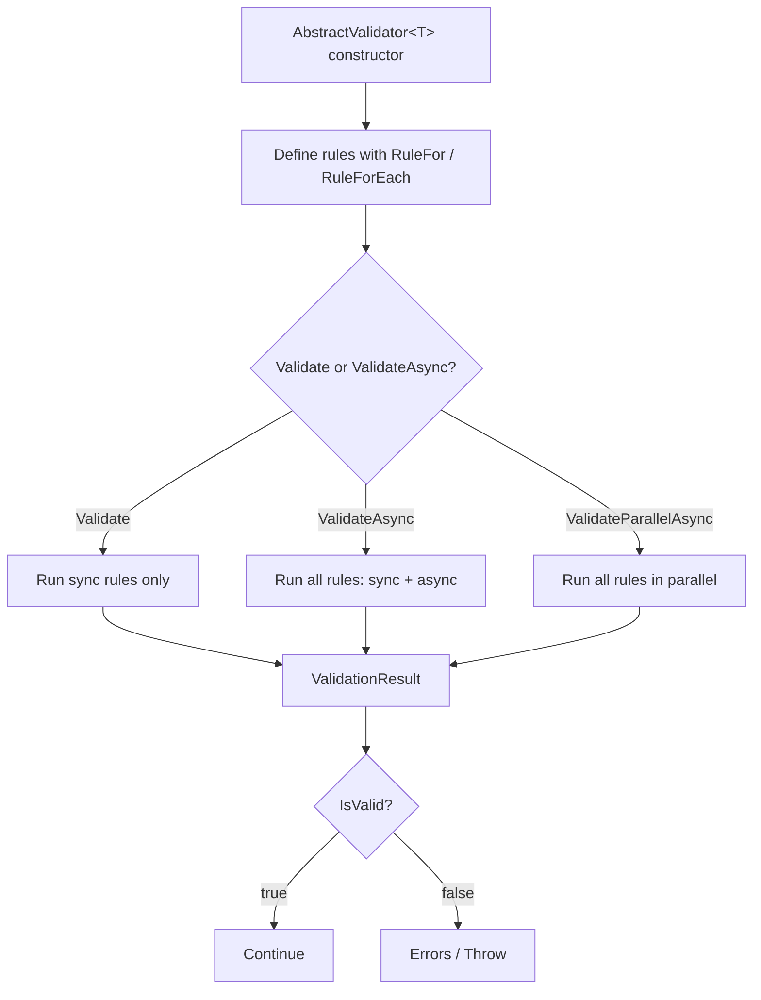

# Validators

## Validator Lifecycle



## AbstractValidator\<T\>

`AbstractValidator<T>` is the base class you must inherit to create any validator. It is where you define all rules using the `RuleFor` method.

### Basic Structure

```csharp
public class OrderValidator : AbstractValidator<Order>
{
    public OrderValidator()
    {
        RuleFor(x => x.CustomerId).NotEmpty();
        RuleFor(x => x.TotalAmount).GreaterThan(0);
        RuleFor(x => x.Items).NotEmptyCollection();
    }
}
```

The `where T : class` constraint means you cannot create validators for value types (structs, int, etc.) directly.

### Dependency Injection in the Constructor

Validators can receive dependencies in the constructor:

```csharp
public class CreateUserValidator : AbstractValidator<CreateUserRequest>
{
    private readonly IUserRepository _userRepository;

    public CreateUserValidator(IUserRepository userRepository)
    {
        _userRepository = userRepository;

        RuleFor(x => x.Email)
            .NotEmpty()
            .Email()
            .MustAsync(async email =>
            {
                var exists = await _userRepository.ExistsByEmailAsync(email);
                return !exists;
            })
            .WithMessage("A user with that email already exists.");
    }
}
```

> **Important:** If the validator receives services via DI, register it as `Scoped` when those services are `Scoped` (such as `DbContext`). See [Dependency Injection](dependency-injection).

---

## RuleFor

`RuleFor` accepts an expression that selects the property to validate. It returns an `IRuleBuilder<T, TProperty>` that allows chaining rules.

```csharp
RuleFor(x => x.Email)
    .NotEmpty()
    .Email()
    .MaximumLength(320);
```

The expression can access nested properties:

```csharp
// Direct property
RuleFor(x => x.Name).NotEmpty();

// Nested property
RuleFor(x => x.Address.Street).NotEmpty();
```

---

## RuleForEach

`RuleForEach` validates each element of a collection. Error keys use indexes: `"Items[0]"`, `"Items[1]"`, etc.

```csharp
RuleForEach(x => x.Lines)
    .Must(line => line.Quantity > 0)
        .WithMessage("The quantity must be greater than 0.")
    .Must(line => line.UnitPrice > 0)
        .WithMessage("The unit price must be greater than 0.");
```

### RuleForEach with SetValidator

```csharp
public class InvoiceLineValidator : AbstractValidator<InvoiceLine>
{
    public InvoiceLineValidator()
    {
        RuleFor(x => x.ProductId).NotEmpty();
        RuleFor(x => x.Quantity).GreaterThan(0);
        RuleFor(x => x.UnitPrice).GreaterThan(0);
    }
}

public class CreateInvoiceValidator : AbstractValidator<CreateInvoiceRequest>
{
    public CreateInvoiceValidator()
    {
        RuleFor(x => x.Lines).NotEmptyCollection();
        RuleForEach(x => x.Lines)
            .SetValidator(new InvoiceLineValidator());
    }
}
```

Errors appear as `"Lines[0].ProductId"`, `"Lines[1].UnitPrice"`, etc.

---

## Include

`Include` copies all rules from another validator into the current validator. Useful for rule inheritance or for composing validators from separate parts.

```csharp
public class ProductBaseValidator : AbstractValidator<Product>
{
    public ProductBaseValidator()
    {
        RuleFor(x => x.Name).NotEmpty().MaximumLength(200);
        RuleFor(x => x.Price).GreaterThan(0);
    }
}

public class CreateProductValidator : AbstractValidator<Product>
{
    public CreateProductValidator()
    {
        Include(new ProductBaseValidator());
        // Additional rules specific to creation
        RuleFor(x => x.Stock).GreaterThanOrEqualTo(0);
        RuleFor(x => x.Category).NotEmpty();
    }
}
```

> **Caution:** `Include` is not the same as `SetValidator`. `Include` takes rules from another validator for the **same type T**. `SetValidator` delegates validation of a **nested property** to a validator of a different type.

---

## RuleSwitch — Case-based Conditional Validation

`RuleSwitch` lets you apply **completely different sets of rules across multiple properties** depending on the value of a discriminator field.

### Syntax

```csharp
RuleSwitch(x => x.DiscriminatorProperty)
    .Case(value1, rules => { /* configure rules on 'rules' */ })
    .Case(value2, rules => { /* configure rules on 'rules' */ })
    .Default(rules =>        { /* fallback when no case matches */ });
```

### Complete Example: Payment Validator

```csharp
public class PaymentValidator : AbstractValidator<PaymentDto>
{
    public PaymentValidator()
    {
        // This rule always applies, regardless of payment method
        RuleFor(x => x.Amount).Positive();

        RuleSwitch(x => x.Method)
            .Case("credit_card", rules =>
            {
                rules.RuleFor(x => x.CardNumber).NotEmpty();
                rules.RuleFor(x => x.Cvv).NotEmpty().MinimumLength(3).MaximumLength(4);
                rules.RuleFor(x => x.CardHolder).NotEmpty();
            })
            .Case("bank_transfer", rules =>
            {
                rules.RuleFor(x => x.Iban).NotEmpty().Iban();
                rules.RuleFor(x => x.BankName).NotEmpty();
            })
            .Case("paypal", rules =>
            {
                rules.RuleFor(x => x.PaypalEmail).NotEmpty().Email();
            })
            .Default(rules =>
            {
                rules.RuleFor(x => x.Reference).NotEmpty();
            });
    }
}
```

### Behavior: Only One Case Executes

`RuleSwitch` evaluates the discriminator once and runs **at most one** case. Cases are not cumulative.

---

## Validation Methods

### Validate (synchronous)

```csharp
ValidationResult result = validator.Validate(instance);
```

The synchronous method executes only synchronous rules. Use it only when you are certain there are no async rules.

### ValidateAsync

```csharp
// Without CancellationToken
ValidationResult result = await validator.ValidateAsync(instance);

// With CancellationToken
ValidationResult result = await validator.ValidateAsync(instance, cancellationToken);
```

Executes all rules, including async ones. This is the recommended method in ASP.NET Core applications.

### ValidateParallelAsync

```csharp
ValidationResult result = await validator.ValidateParallelAsync(instance);
ValidationResult result = await validator.ValidateParallelAsync(instance, cancellationToken);
```

Executes all async rules **in parallel**. Useful when there are multiple `MustAsync` calls that make independent database or external service calls.

> **Warning:** Do not use `ValidateParallelAsync` if rules have side effects or dependencies between them.

### ValidateAndThrow / ValidateAndThrowAsync

```csharp
// Throws ValidationException if validation fails
validator.ValidateAndThrow(instance);
await validator.ValidateAndThrowAsync(instance);
await validator.ValidateAndThrowAsync(instance, cancellationToken);
```

Equivalent to `ValidateAsync` + `IsValid` check + throwing `ValidationException`. Useful in service layers where you prefer to propagate the exception.

See [Exceptions](exceptions) for more details about `ValidationException`.

---

## IValidator\<T\> — Interface for DI

Always inject `IValidator<T>` instead of the concrete implementation:

```csharp
public interface IValidator<T>
{
    ValidationResult Validate(T instance);
    Task<ValidationResult> ValidateAsync(T instance);
    Task<ValidationResult> ValidateAsync(T instance, CancellationToken ct);
    Task<ValidationResult> ValidateParallelAsync(T instance);
    Task<ValidationResult> ValidateParallelAsync(T instance, CancellationToken ct);
    void ValidateAndThrow(T instance);
    Task ValidateAndThrowAsync(T instance);
    Task ValidateAndThrowAsync(T instance, CancellationToken ct);
}
```

```csharp
// Correct: depends on the interface
public class UserController : ControllerBase
{
    private readonly IValidator<CreateUserRequest> _validator;

    public UserController(IValidator<CreateUserRequest> validator)
    {
        _validator = validator;
    }
}
```

---

## Global CascadeMode

By default, if a property has multiple rules and the first one fails, all the others are still evaluated. You can change this behavior globally:

```csharp
public class StrictValidator : AbstractValidator<PaymentRequest>
{
    protected override CascadeMode GlobalCascadeMode => CascadeMode.StopOnFirstFailure;

    public StrictValidator()
    {
        RuleFor(x => x.CardNumber)
            .NotEmpty()
            .CreditCard();

        RuleFor(x => x.ExpiryMonth)
            .GreaterThan(0)
            .LessThanOrEqualTo(12);
    }
}
```

See [CascadeMode](cascade-mode) for the full comparison.

---

## Next Steps

- **[Basic Rules](basic-rules)** — Catalog of all available rules
- **[Advanced Rules](advanced-rules)** — Must, MustAsync, Custom, Transform, SetValidator
- **[CascadeMode](cascade-mode)** — Validation flow control
